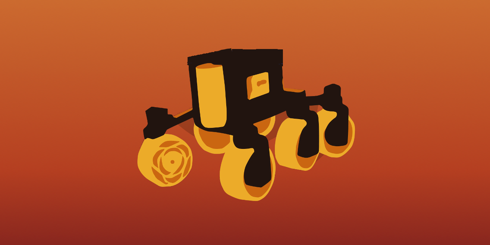
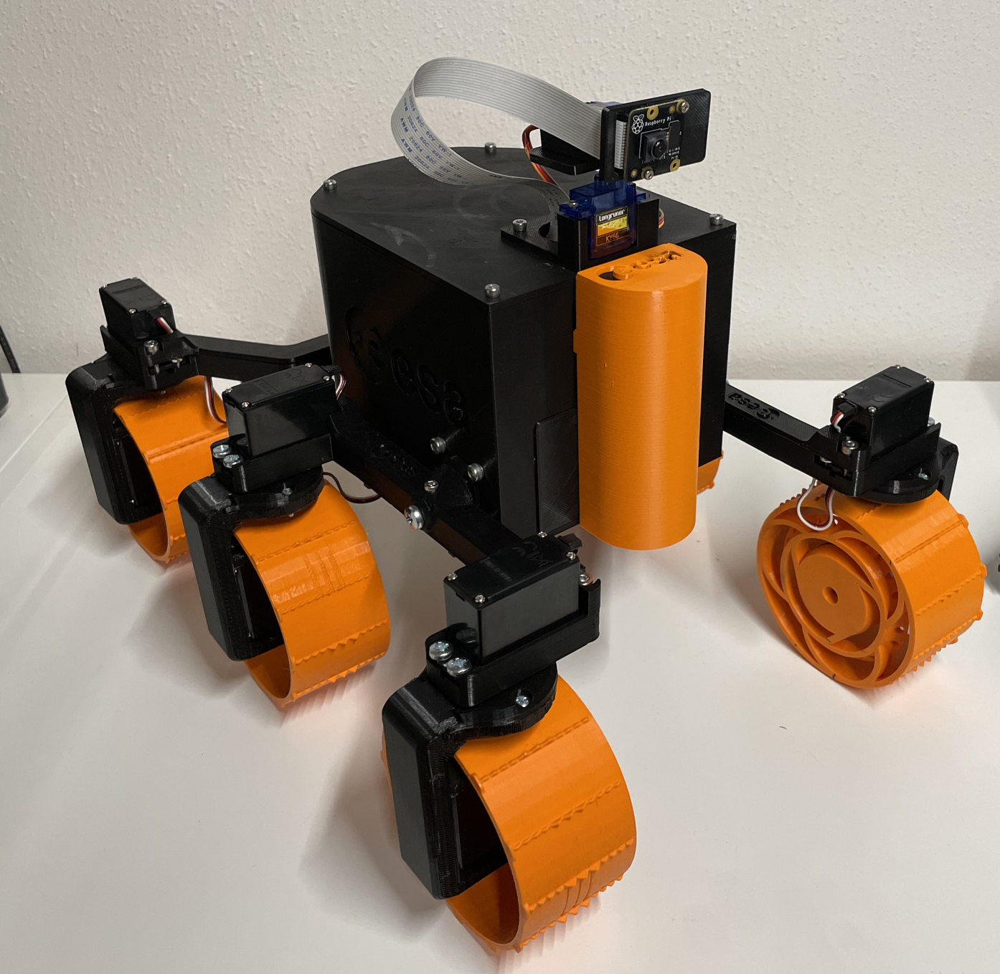
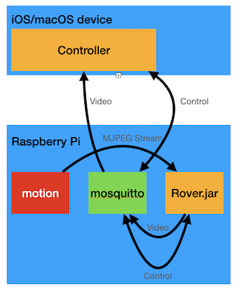
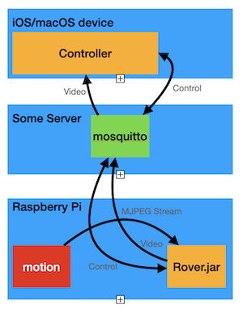
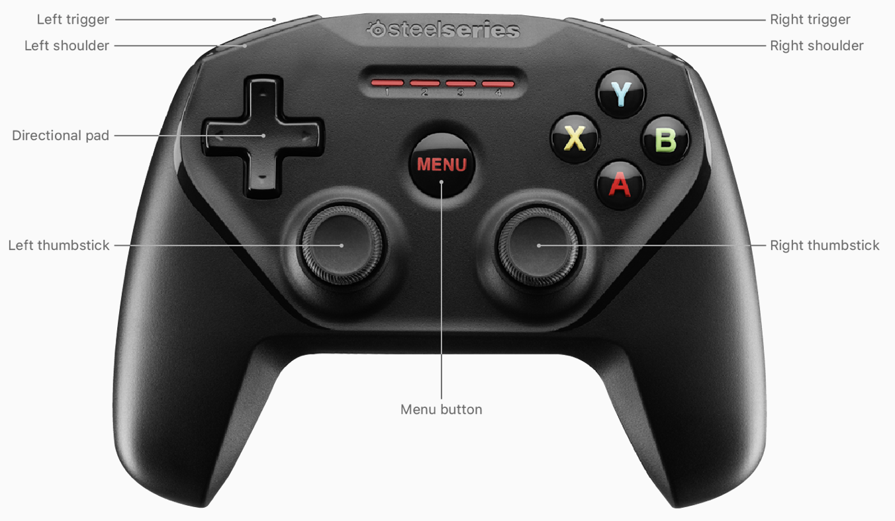

# ExoMax

ExoMax is an adaptation of ExoMy (https://github.com/esa-prl/ExoMy) using an alternative software stack as well as a pan and tilt camera instead of the fixed one from the original.



It uses `motion` for video stream generation, a `Kotlin/JVM` Rover Software running on a Raspberry Pi, a universal `Swift` App that can run on AppleTV, iPad and Mac.
Communication is realized using `mosquitto`. Video is taken directly from the local `motion` instance as MJPEG and resized on the fly. Then every image is published via MQTT. This is not very efficient but it makes the whole setup extremely flexible in terms of where to put each component.



Here, the `mosquitto` is located on the rover directly, it can also be placed somewhere else. By doing this, full remote control via internet can be achieved.




## Rover Software

The Rover Software is an IntelliJ IDEA Project. You can directly open it. Before building it there are a few steps to be taken first.

### Basic Raspberry Pi setup
Install a Raspberrypi OS headless and enable ssh. Connect to the Raspi using Ethernet and setup Wifi using `sudo raspi-config`. Also rename your Raspberry to `Exomax`. This ist the hostname that is used throughout the whole project.

We need a small set of software to be installed:
|Package|Why|
|--|--|
|OpenJDK8 | Our Rover Software runs on this|
|Motion | Used for streaming video|
|Wiringpi | To interface with I2C using Pi4J|
|mosquitto | The MQTT broker |

````
sudo apt-get install openjdk-8-jre-headless motion wiringpi mosquitto
sudo systemctl enable mosquitto.service
sudo systemctl enable motion
sudo systemctl start motion
````

### Configure Motion

Edit `/etc/motion/motion.conf` and modify the following lines
````
# Start in daemon (background) mode and release terminal (default: off)
daemon on

# Level of log messages [1..9] (EMG, ALR, CRT, ERR, WRN, NTC, INF, DBG, ALL). (default: 6 / NTC)
log_level 1

# Image width (pixels). Valid range: Camera dependent, default: 320
width 800

# Image height (pixels). Valid range: Camera dependent, default: 240
height 600

# Maximum number of frames to be captured per second.
# Valid range: 2-100. Default: 100 (almost no limit).
framerate 15

# Output pictures with only the pixels moving object (ghost images) (default: off)
output_debug_pictures off

# Use ffmpeg to encode videos of motion (default: off)
ffmpeg_output_movies off

# Make automated snapshot every N seconds (default: 0 = disabled)
snapshot_interval 0

# Output frames at 1 fps when no motion is detected and increase to the
# rate given by stream_maxrate when motion is detected (default: off)
stream_motion off

# The mini-http server listens to this port for requests (default: 0 = disabled)
stream_port 8081

# Maximum framerate for stream streams (default: 1)
stream_maxrate 15

# Restrict stream connections to localhost only (default: on)
stream_localhost off
````
Try it using a Webbrowser by accessing http://exomax:8081.
Check the `/var/lib/motion` folder if no images or videos are stored. This can destroy your Raspberry. If there are files other than the log file then you might need to adapt the config file.

````
sudo systemctl restart motion
````

### Install Pi4J

I installed Pi4J using the recommended way by `curl -sSL https://pi4j.com/install | sudo bash`, However, It might be advisable to check with the instructions first https://pi4j.com/1.2/install.html

### Build The Rover Software
Build the Artifact and use `copyToRover.sh` in order to clean unused certificates and copy the jar to the Raspberry.

### Servo configuration
Currently there is no automated process to configure the servos but this is rather straight forward. You just need to know what servo is connected to which pin. In `ServoController.kt` the servos are configured as constants. they are named after their position on the rover. `frd` is front right drive, `mls` is middle left steering and so on. There is always a drive servo as well as a steering servo.  
When there is no camera attached to your rover, just ignore the camera servos.


### Setup the Rover Software and make it start up on system boot.

Create a new file at `/etc/systemd/system/exomax.service`

With the following content:

````
[Unit]
Description=Exomax Rover Software
Wants=network.target
After=network.target

[Service]
Type=simple
Restart=always
ExecStart=/bin/bash -c "java -jar /home/pi/Rover.jar"
Restart=always

[Install]
WantedBy=multi-user.target
````

Enable autostart for the rover software using `sudo systemctl enable mosquitto.service`.

Now the Rover should be good to go. Reboot.

## Controller Software

Open the Controller Software in XCode and run it on any device.

There is a version for iOS, optimized for landscape view on iPhone and iPad. There is also a version for macOS which should run on all Macs (including M1) and one for AppleTV. Exomax is controlled using a game controller in all cases. It is possible to connect up to 4 controllers, all of them are then assigned the same functionality and can be used simultaneously. On touchscreen devices, the buttons for switching the driving modes are also active.
Communication to MQTT is established every time the App enters foreground mode and disconnected with the inactive state. The controller assignment is as follows:




|Button|ExoMax Behavior|
|--|--|
|Directional Pad|	Fixed camera positions|
|A|Ackermann driving mode|
|B|Spot Turn driving mode|
|X|Crabbing driving mode|
|Y|Center Camera|
|Left shoulder|Increase speed by 10 and lock speed control|
|Left trigger|Stop and release speed control|
|Right shoulder|Decrease speed by 10 and lock speed control|
|Right trigger|Stop and release speed control|
|Left thumbstick|Drive control|
|Right thumbstick|Free Camera Control|
